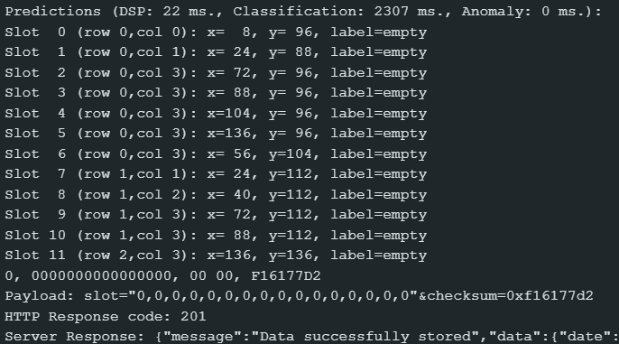
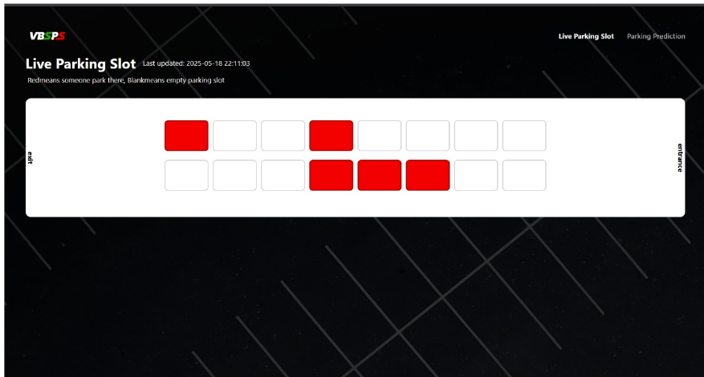
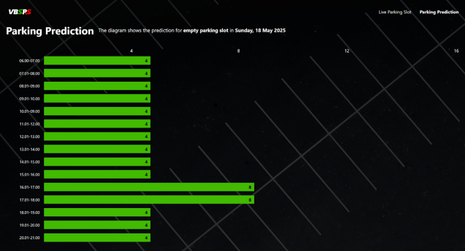

# Vision-based Smart Parking System (VBSPS)

VBSPS is our college project on the [Capstone Project][capstone] course at
[Faculty of Computer Science Universitas Brawijaya][filkom-ub]
with the topic of Artificial Internet Of Things (AIoT). The solution provided
by this project is so that civitas academica in the campus can find
parking slots just by looking at a web interface. (It's still a prototype)

## Features

1. Detect the cars by using [FOMO MobileNetV2 0.35][fomo-mobilenet]
(train & test in [Edge Impulse][edge-impulse] using model/toy cars with
180+ dataset)

2. Predict the crowdedness of the parking slots by using
[Time Series Forecasting Algorithm][time-series] with the projection
of 30 days. (TODO: Code & Explanations Later)

3. Display them in [Laravel Web App][laravel] (TODO: Code & Explanations later)

4. Using [AWS Cloud Services][aws] as the web infrastructure
(TODO: Code & Explanations later)

## Requirements

1. ESP32-CAM (with OV2640 or OV5640 Camera Module)
2. Arduino IDE (with basic C/C++, WiFi, and HTTPClient Libraries installed)
3. Programmer USB Cable (for uploading to ESP32-CAM)

## Get Started

1. Download this repository

    ```console
    git clone https://github.com/maux-unix/vbsps
    ```

2. Open 'esp32_cam1/esp32_cam1.ino' using Arduino IDE

3. Navigate to Sketch -> Include Library -> Add .ZIP Library

4. Add the 'ei-kepstun-bismillah-bisa-arduino-1.0.2.zip' from the folder

5. Build and Upload from the 'esp32_cam1.ino' sketch (be patient, sometimes
it's slow, depends on your machine)

## Results

1. Serial Monitor from Arduino IDE
    
2. Live Parking Slot (TODO: Code & Explanations Later)
    
3. Prediction (TODO: Code & Explanations Later)
    
4. Video (Language: Bahasa Indonesia)
    

## Contributors

1. Faiz I. Akram
2. Kurnita R. Widyana
3. Maulana M. Ali
4. Naufal A. Dinata
5. Zaenal A. Radityo

<!-- Links -->
[filkom-ub]: https://filkom.ub.ac.id/
[capstone]: https://filkom.ub.ac.id/2025/01/22/informasi-mk-capstone-project-terintegrasi/
[edge-impulse]: https://edgeimpulse.com/
[fomo-mobilenet]: https://docs.edgeimpulse.com/docs/edge-impulse-studio/learning-blocks/object-detection/fomo-object-detection-for-constrained-devices
[time-series]: https://www.geeksforgeeks.org/time-series-analysis-and-forecasting/
[laravel]: https://laravel.com/
[aws]: https://aws.amazon.com/
